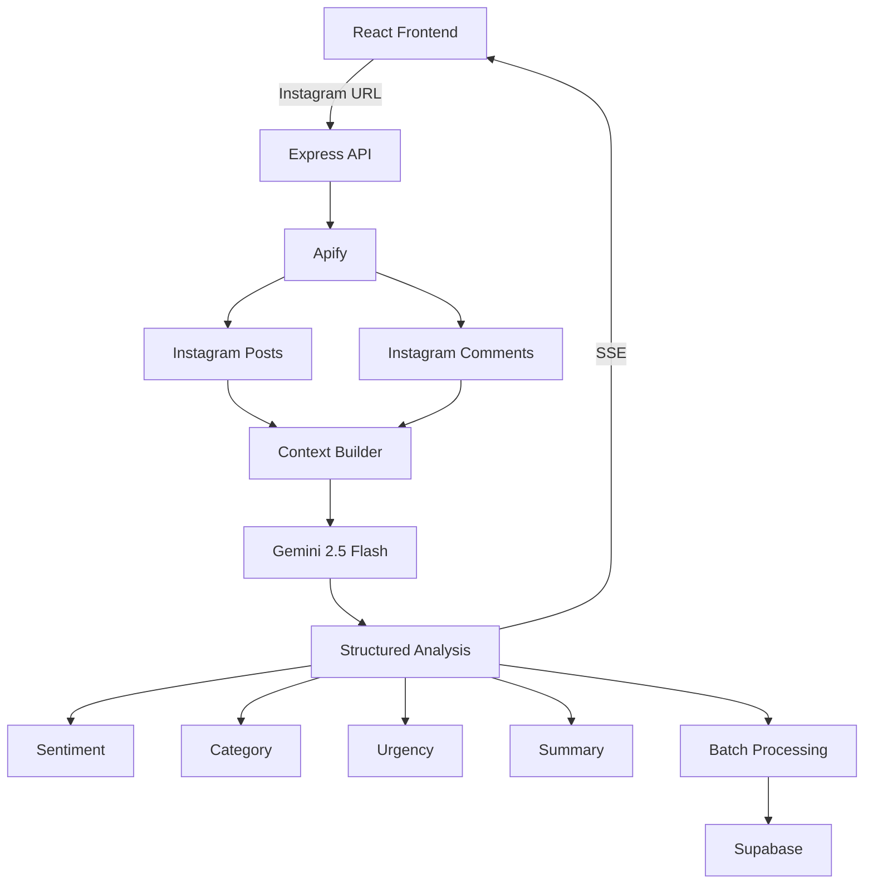

# 🧠 Multichannel Analyst

> Plataforma Full Stack de análise de feedbacks com Inteligência Artificial, NLP, Web Scraping e processamento em tempo real.

O **Multichannel Analyst** é uma aplicação desenvolvida para transformar comentários e feedbacks não estruturados de redes sociais em informações organizadas e acionáveis.

Atualmente, o projeto possui integração com o **Instagram**, utilizando a Apify para coletar posts e comentários. Cada comentário é processado pelo **Google Gemini**, que identifica automaticamente:

- sentimento;
- categoria;
- nível de urgência;
- resumo do feedback.

Os resultados são enviados ao frontend em tempo real através de **Server-Sent Events (SSE)** e podem ser persistidos no **Supabase** para análises posteriores.

---

## 🎯 Objetivo

Empresas recebem grandes volumes de feedbacks através de redes sociais, comentários e outros canais digitais.

Analisar manualmente essas interações pode dificultar a identificação de padrões importantes, como:

- reclamações recorrentes;
- problemas de suporte;
- feedbacks sobre produto;
- problemas financeiros;
- comentários positivos;
- situações urgentes;
- mudanças na percepção dos clientes.

O Multichannel Analyst cria uma camada de inteligência sobre esses dados.

Em vez de apenas exibir comentários, o sistema transforma cada interação em dados estruturados que podem ser utilizados para **Customer Experience, Revenue Operations, Marketing, Suporte e análise de produto**.

---

## ⚙️ Como funciona

O fluxo principal da aplicação é:

```text
Instagram Profile
       │
       ▼
      Apify
       │
       ├── Posts
       └── Comentários
       │
       ▼
Contextualização dos dados
       │
       ▼
Google Gemini 2.5 Flash
       │
       ▼
Análise estruturada
       │
       ├── Sentimento
       ├── Categoria
       ├── Urgência
       └── Resumo
       │
       ├──────────────► Frontend via SSE
       │
       └──────────────► Supabase
```

O usuário informa a URL de um perfil do Instagram no frontend.

O backend então executa o pipeline de coleta, processamento e análise dos comentários.

---

## 📸 Coleta de dados do Instagram

A integração com Instagram é realizada através da **Apify API**.

O sistema utiliza o Actor:

```text
apify/instagram-scraper
```

O processo ocorre em duas etapas.

### 1. Busca dos posts

A aplicação coleta os posts mais recentes do perfil informado.

Além da URL de cada publicação, a legenda do post é armazenada temporariamente para fornecer contexto à análise.

### 2. Busca dos comentários

Depois de identificar os posts, o sistema coleta comentários associados às publicações.

Cada comentário é transformado em uma estrutura semelhante a:

```json
{
  "texto": "Comentário feito pelo usuário",
  "urlPost": "https://instagram.com/p/...",
  "textoPost": "Contexto da publicação original..."
}
```

Assim, a aplicação consegue manter a relação entre o comentário e o conteúdo em que ele foi publicado.

---

## 🤖 Inteligência Artificial

A análise dos comentários é realizada utilizando:

```text
Google Gemini 2.5 Flash
```

O modelo recebe cada comentário individualmente e atua como um **analista de Revenue Operations**, classificando o feedback de maneira estruturada.

A resposta é gerada diretamente em JSON através de um schema definido na aplicação.

---

## 🧠 Estrutura da análise

Cada comentário recebe quatro informações principais.

### Sentimento

Classificação geral da interação:

```text
Positivo
Negativo
Neutro
```

### Categoria

O comentário também é classificado de acordo com o assunto principal:

```text
Financeiro
Produto
Suporte
Outros
```

### Urgência

A IA atribui um nível de urgência entre:

```text
1 → Baixa
2
3
4
5 → Crítica
```

Isso permite identificar rapidamente comentários que podem exigir atenção prioritária.

### Resumo

O Gemini gera um resumo curto do problema ou feedback apresentado pelo usuário.

---

## 📦 Exemplo de resposta da IA

```json
{
  "sentimento": "Negativo",
  "categoria": "Suporte",
  "urgencia": 4,
  "resumo": "Cliente relata dificuldade para obter retorno do suporte."
}
```

Outro exemplo:

```json
{
  "sentimento": "Positivo",
  "categoria": "Produto",
  "urgencia": 1,
  "resumo": "Cliente elogia a nova experiência do aplicativo."
}
```

---

## ⚡ Processamento em tempo real

Uma das principais características do projeto é o acompanhamento do pipeline em tempo real.

O backend utiliza **Server-Sent Events (SSE)** para manter uma conexão aberta com o frontend enquanto os comentários são processados.

Endpoint:

```http
GET /api/analyze
```

Exemplo:

```http
GET /api/analyze?url=https://www.instagram.com/ifoodbrasil/
```

Durante a execução, o servidor envia diferentes tipos de eventos.

### `log`

Mensagens sobre o estado atual do pipeline.

```json
{
  "message": "Buscando comentários do Instagram via Apify..."
}
```

### `progress`

Indica qual comentário está sendo analisado.

```json
{
  "current": 3,
  "total": 20,
  "status": "analyzing",
  "text": "Texto do comentário..."
}
```

### `result`

Envia imediatamente um comentário já analisado.

```json
{
  "index": 3,
  "texto_original": "Estou há dias esperando retorno.",
  "url_post": "https://instagram.com/p/...",
  "texto_post": "Legenda original...",
  "sentimento": "Negativo",
  "categoria": "Suporte",
  "urgencia": 5,
  "resumo": "Cliente relata demora no atendimento."
}
```

### `done`

Indica a conclusão do processamento.

```json
{
  "status": "success",
  "count": 20
}
```

Dessa forma, o usuário não precisa aguardar o processamento completo para visualizar os resultados.

---

## 🔄 Pipeline de processamento

Para cada comentário coletado, o backend executa:

```text
Comentário
   │
   ▼
Envio ao Gemini
   │
   ▼
Structured Output
   │
   ├── Sentimento
   ├── Categoria
   ├── Urgência
   └── Resumo
   │
   ▼
Evento SSE enviado ao frontend
   │
   ▼
Resultado adicionado ao lote
   │
   ▼
Persistência no Supabase
```

A aplicação também possui tratamento de erros e tentativas adicionais durante o processamento.

---

## 💾 Persistência com Supabase

Após o processamento, as análises são armazenadas no **Supabase**.

A tabela utilizada atualmente é:

```text
feedbacks_analisados
```

Estrutura esperada:

```text
feedbacks_analisados
│
├── texto_original
├── sentimento
├── categoria
├── urgencia
├── resumo
└── criado_em
```

Exemplo de registro:

```json
{
  "texto_original": "O atendimento está demorando muito.",
  "sentimento": "Negativo",
  "categoria": "Suporte",
  "urgencia": 4,
  "resumo": "Cliente reclama sobre demora no atendimento.",
  "criado_em": "2026-01-01T12:00:00.000Z"
}
```

As análises são inseridas em lote ao final do processamento.

---

## 🖥️ Frontend

O frontend foi desenvolvido utilizando:

- React 19
- TypeScript
- Vite
- Tailwind CSS

A interface permite:

- informar um perfil do Instagram;
- iniciar uma análise;
- acompanhar logs da execução;
- visualizar o progresso em tempo real;
- receber resultados conforme são processados;
- visualizar sentimento;
- visualizar categoria;
- identificar nível de urgência;
- visualizar resumo da IA;
- visualizar o comentário original;
- manter contexto com o post de origem.

---

## 📊 Interface de análise

Cada feedback processado pode apresentar informações como:

```text
┌────────────────────────────────────────────┐
│ Negativo            Suporte       ★★★★★   │
│                                            │
│ Cliente relata demora no atendimento.     │
│                                            │
│ Comentário original                        │
│ "Estou tentando contato há vários dias."  │
│                                            │
│ Contexto do post                           │
│ "Conheça nossa nova funcionalidade..."    │
└────────────────────────────────────────────┘
```

Isso permite transformar comentários dispersos em uma fila de informações estruturadas.

---

## 🧪 Mock de dados

O projeto também possui um mecanismo de fallback para facilitar desenvolvimento e testes.

Caso:

```text
APIFY_API_TOKEN
```

não esteja configurado, ou ocorra uma falha durante a coleta na Apify, a aplicação pode utilizar comentários mockados.

Isso permite testar o restante do pipeline sem depender continuamente do scraper externo.

---

## 🛠️ Stack

### Backend

- **Node.js**
- **Express.js**
- **TypeScript**
- **CORS**
- **dotenv**

### Inteligência Artificial

- **Google Gemini 2.5 Flash**
- **Google Generative AI SDK**
- Structured JSON Outputs
- Prompt Engineering
- Natural Language Processing (NLP)

### Data Collection

- **Apify**
- Instagram Scraper
- Web Scraping
- APIs externas

### Database

- **Supabase**
- PostgreSQL

### Frontend

- **React 19**
- **TypeScript**
- **Vite**
- **Tailwind CSS**

### Comunicação

- **REST API**
- **Server-Sent Events (SSE)**

### Infraestrutura

- **Vercel**

---

## 🏗️ Arquitetura



---

## 📁 Estrutura do projeto

```text
multichannel-analyst/
│
├── src/
│   ├── index.ts
│   │
│   └── services/
│       ├── geminiService.ts
│       ├── instagramService.ts
│       └── supabaseService.ts
│
├── frontend/
│   ├── src/
│   │   ├── App.tsx
│   │   ├── App.css
│   │   ├── index.css
│   │   └── main.tsx
│   │
│   ├── package.json
│   └── vite.config.ts
│
├── package.json
├── tsconfig.json
├── vercel.json
└── README.md
```

---

## 📄 Principais arquivos

### `src/index.ts`

Responsável pela orquestração do pipeline.

Entre suas responsabilidades estão:

- criação do servidor Express;
- endpoint `/api/analyze`;
- conexão SSE;
- coleta dos comentários;
- processamento sequencial;
- envio de progresso;
- envio dos resultados ao frontend;
- tratamento de erros;
- persistência final no Supabase.

---

### `src/services/instagramService.ts`

Responsável pela integração com a Apify e coleta dos dados do Instagram.

Executa:

1. busca dos posts;
2. armazenamento do contexto das publicações;
3. coleta dos comentários;
4. relacionamento entre comentário e post;
5. normalização dos resultados;
6. fallback para dados mockados.

---

### `src/services/geminiService.ts`

Responsável pela camada de Inteligência Artificial.

Define:

- modelo Gemini utilizado;
- system prompt;
- schema da resposta;
- categorias permitidas;
- classificação de sentimento;
- nível de urgência;
- geração do resumo.

---

### `src/services/supabaseService.ts`

Responsável pela persistência dos resultados.

Implementa:

- conexão com Supabase;
- inserção individual;
- inserção em lote;
- transformação dos dados antes da persistência.

---

### `frontend/src/App.tsx`

Responsável pela interface principal da aplicação.

Implementa:

- campo para URL alvo;
- conexão com SSE;
- terminal de logs;
- acompanhamento de progresso;
- atualização dos resultados em tempo real;
- visualização das análises.

---

## 🔐 Variáveis de ambiente

Crie um arquivo:

```text
.env
```

na raiz do projeto.

Exemplo:

```env
GEMINI_API_KEY=
APIFY_API_TOKEN=

SUPABASE_URL=
SUPABASE_KEY=

INSTAGRAM_URL=https://www.instagram.com/ifoodbrasil/

PORT=3001
```

### `GEMINI_API_KEY`

Chave utilizada para acessar o Google Gemini.

### `APIFY_API_TOKEN`

Token utilizado para executar o Instagram Scraper da Apify.

Sem esse token, o serviço utiliza dados mockados para permitir testes do pipeline.

### `SUPABASE_URL`

URL do projeto no Supabase.

### `SUPABASE_KEY`

Chave utilizada para acessar o projeto no Supabase.

### `INSTAGRAM_URL`

URL opcional utilizada pelo backend quando nenhuma URL é enviada através do endpoint.

### `PORT`

Porta utilizada pelo backend.

Por padrão:

```text
3001
```

> Nunca adicione suas chaves reais de API ao repositório.

---

## 🗄️ Configuração do Supabase

Crie uma tabela chamada:

```text
feedbacks_analisados
```

Uma estrutura possível é:

```sql
CREATE TABLE feedbacks_analisados (
    id BIGINT GENERATED BY DEFAULT AS IDENTITY PRIMARY KEY,
    texto_original TEXT NOT NULL,
    sentimento TEXT NOT NULL,
    categoria TEXT NOT NULL,
    urgencia INTEGER NOT NULL,
    resumo TEXT,
    criado_em TIMESTAMPTZ DEFAULT NOW()
);
```

---

## 🚀 Executando localmente

### 1. Clone o repositório

```bash
git clone https://github.com/flavio-silva0/multichannel-analyst.git

cd multichannel-analyst
```

---

### 2. Configure as variáveis de ambiente

Crie:

```text
.env
```

e adicione:

```env
GEMINI_API_KEY=your_key
APIFY_API_TOKEN=your_token

SUPABASE_URL=your_supabase_url
SUPABASE_KEY=your_supabase_key

PORT=3001
```

---

### 3. Instale as dependências do backend

```bash
npm install
```

---

### 4. Execute o backend em desenvolvimento

```bash
npm run dev
```

O servidor ficará disponível em:

```text
http://localhost:3001
```

---

### 5. Instale o frontend

Em outro terminal:

```bash
cd frontend
npm install
```

---

### 6. Execute o frontend

```bash
npm run dev
```

O frontend será disponibilizado pelo Vite, normalmente em:

```text
http://localhost:5173
```

---

## 🏭 Build de produção do backend

Compile o TypeScript:

```bash
npm run build
```

Execute:

```bash
npm start
```

---

## 🏭 Build de produção do frontend

Dentro da pasta:

```text
frontend
```

execute:

```bash
npm run build
```

Os arquivos finais serão gerados em:

```text
frontend/dist
```

---

## ☁️ Deploy

O projeto possui um:

```text
vercel.json
```

configurado para executar o backend TypeScript utilizando:

```text
@vercel/node
```

O arquivo:

```text
src/index.ts
```

funciona como entrypoint do backend na Vercel.

> O frontend atualmente se conecta ao backend utilizando `http://localhost:3001`. Para utilizar frontend e backend em produção, altere a URL usada pelo `EventSource` para apontar para o endereço da API publicada.

Uma evolução recomendada seria utilizar uma variável como:

```env
VITE_API_URL=
```

e construir a conexão no frontend através dela.

Exemplo:

```ts
const apiUrl = import.meta.env.VITE_API_URL;

const eventSource = new EventSource(
  `${apiUrl}/api/analyze?url=${encodeURIComponent(targetUrl)}`
);
```

---

## 🔌 API

### Iniciar análise

```http
GET /api/analyze?url={INSTAGRAM_PROFILE_URL}
```

Exemplo:

```text
http://localhost:3001/api/analyze?url=https%3A%2F%2Fwww.instagram.com%2Fifoodbrasil%2F
```

Essa rota mantém uma conexão **SSE** aberta até a conclusão do pipeline.

---

## 📡 Eventos SSE

O frontend escuta quatro eventos principais:

```text
log
progress
result
done
```

Também existe tratamento para erros durante a conexão.

Isso permite que cada resultado apareça na interface imediatamente após ser processado.

---

## 💡 Casos de uso

O Multichannel Analyst poderia ser aplicado em cenários como:

- monitoramento de percepção de marca;
- Voice of Customer;
- análise de Customer Experience;
- priorização de reclamações;
- identificação de problemas recorrentes;
- Social Listening;
- Product Feedback;
- suporte ao cliente;
- Revenue Operations;
- análise de campanhas;
- categorização automática de feedbacks.

---

## 🔮 Evoluções possíveis

O projeto foi estruturado de forma que novas fontes de feedback possam ser incorporadas futuramente.

Algumas possíveis evoluções:

- integração com TikTok;
- integração com YouTube;
- integração com X/Twitter;
- integração com Reclame Aqui;
- integração com WhatsApp;
- análise de reviews;
- classificação de intenção;
- detecção automática de tópicos;
- dashboards históricos;
- análise de tendência de sentimento;
- identificação de temas recorrentes;
- alertas para comentários críticos;
- agrupamento semântico de feedbacks;
- análise comparativa entre canais;
- autenticação de usuários;
- filas assíncronas para grandes volumes;
- processamento paralelo;
- suporte a webhooks.

Atualmente, a fonte implementada é o **Instagram**.

---

## 🧩 Conceitos explorados

O desenvolvimento do projeto envolve:

- Full Stack Development;
- TypeScript;
- React;
- Node.js;
- Express;
- REST APIs;
- Server-Sent Events;
- Artificial Intelligence;
- Generative AI;
- Natural Language Processing;
- Structured Outputs;
- Prompt Engineering;
- Web Scraping;
- API Integration;
- Supabase;
- processamento de dados não estruturados;
- persistência de dados;
- arquitetura orientada a serviços;
- tratamento de erros;
- processamento em tempo real.

---

## 🎯 Visão do projeto

O objetivo do Multichannel Analyst é transformar grandes volumes de interações não estruturadas em uma camada de dados que facilite decisões.

Em vez de analisar manualmente centenas de comentários para descobrir o que os clientes estão dizendo, o sistema cria automaticamente uma estrutura como:

```text
Feedback
   ↓
Sentimento
   ↓
Categoria
   ↓
Urgência
   ↓
Resumo
   ↓
Insight acionável
```

A ideia é aproximar **Inteligência Artificial, Customer Experience e Revenue Operations**, permitindo transformar conversas e feedbacks digitais em informações úteis para operação e tomada de decisão.

---

## 👨‍💻 Autor

**Flavio Silva**

Projeto desenvolvido como estudo e aplicação prática de:

**Full Stack Development + Artificial Intelligence + NLP + API Integration + Data Processing**

---

## 📌 Status atual

A implementação atual possui:

- ✅ Backend Node.js + Express + TypeScript
- ✅ Frontend React + TypeScript
- ✅ Integração com Instagram via Apify
- ✅ Análise utilizando Gemini 2.5 Flash
- ✅ Structured JSON Output
- ✅ Sentiment Analysis
- ✅ Categorização de feedback
- ✅ Urgency Scoring
- ✅ Resumos com IA
- ✅ Streaming de resultados via SSE
- ✅ Persistência no Supabase
- ✅ Fallback com dados mockados
- ⏳ Expansão para novos canais
- ⏳ Dashboard histórico
- ⏳ Alertas automáticos
